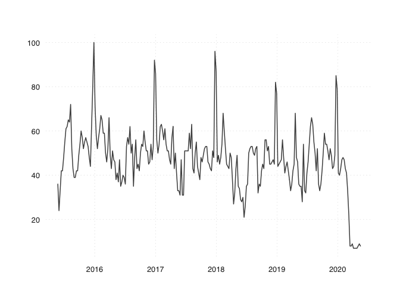

<!-- README.md is generated from README.Rmd. Please edit that file -->

## Create Daily Series from Google Trends

<!-- badges: start -->

[](https://github.com/trendecon/trendecon/actions)
[](https://travis-ci.com/trendecon/trendecon)
[](https://milano-r.github.io/erum2020-covidr-contest/trendecon.html)
<!-- badges: end -->

This package contains R code to construct long daily time series from
Google Trends. Robustness of the data is achieved by querying Google
mulitple times. The queries are sampled at daily, weekly and monthy
frequencies and then harmonized such that the long term trend is
preserved. The download itself relies on the
[gtrendsR](https://CRAN.R-project.org/package=gtrendsR) package by
Philippe Massicotte and Dirk Eddelbuettel.

The website [www.trendecon.org](https://www.trendecon.org) applies the
package and provides a set of indicators for Switzerland and is updated
daily. During the Covid-19 pandemic, such high-frequency indicators have
been in high demand. We use Google search trends to create meaningful
indicators that don’t suffer from this problem. In particular, we
extract daily search data on keywords reflecting consumers’ perception
of the economic situation.

The project was inititated during the
[\#versusvirus](https://www.versusvirus.ch) and got
[funding](https://www.versusvirus.ch/funding) from the hackathon.

### Installation

You can install the trendecon package from GitHub.

``` r
# install.packages("remotes")
remotes::install_github("trendecon/trendecon")
```

### Usage

To download a series from Google Trends:

``` r
library(trendecon)
x <- ts_gtrends("cinema", geo = "CH")
#> Downloading data for today+5-y
tsbox::ts_plot(x)
```



### Documentation

The [introductory
vignette](https://trendecon.github.io/trendecon/articles/intro.html)
describes the basic use of the package.

To create and update long daily series from Google Trends, see the
[vignette on daily
series](https://trendecon.github.io/trendecon/articles/daily-series.html).
